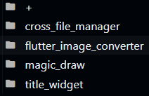

# Fresher: Keep Your Projects Up to Date


[](https://opensource.org/licenses/MIT)
[](https://pub.dartlang.org/packages/fresher)
[](https://github.com/signmotion/fresher)
[](https://pub.dev/publishers/syrokomskyi.com)

[](https://github.com/signmotion/fresher/actions)
[](https://github.com/signmotion/fresher/pulls)
[](https://github.com/signmotion/fresher/issues)
[](https://pub.dev/packages/fresher/score)

An _invisible_ tool to help keep your **multiple** projects in **multiple** repositories up to date:
automated upgrade dependencies, update links and sections in `README`, `CONTRIBUTING`, `STYLEGUIDE`, wiki, etc.
The easy-to-use and [well-tested](https://github.com/signmotion/fresher/tree/master/test) Dart CLI.
Feel free to use it in your awesome project.

[](https://codefactor.io/repository/github/signmotion/fresher)

Share some ❤️ and star repo to support the project.

_If you write an article about **Fresher** or any of [these](https://pub.dev/packages?q=publisher%3Asyrokomskyi.com&sort=updated) packages, let me know and I'll post the URL of the article in the **README**_ 🤝

## 🔥 Motivation

The road to 🖤 is paved with good intentions.

I just wanted to show in the `README`s of my packages how to contribute to open-source, because I remember how hard it was to start doing that for me. The problem was that when the thought came to my mind, I already had dozens packages in pub.dev... Well, I did it manually that time.

After seeing the shields in other packages (thanks for that, guys and gals) and wanting to add them to my packages too... And this time I did it by hand.

One sunny aftenoon I read on Reddit that people are looking for projects to help the open-source community, and I read in the comments about [CodeTriangle](https://codetriage.com) - Free community tools for contributing... And that time I did it by hand for some of my packages.

When I came across resources like [The ultimate Flutter resources](https://github.com/yassine-bennkhay/Ultimate-Flutter-Resources) and [Learn Dart in Y minutes](https://learnxinyminutes.com/docs/dart), I wanted to add them too because both Dart and Flutter are really 🌟 awesome.

More packages were added, and more time was spent on updating them. Should I go on?

Honestly, I didn't want to create this package because I recognize the complexities and I [heard](https://reddit.com/r/dartlang/comments/1bzltni/a_build_system_for_dozens_of_flutter_dart_projects): "Melos / Cider / Publish Tools / Sideckick (choose one of them) will solve your problems with Dart / Flutter package maintenance". I spent ~2 weeks researching the available tools and I've tabulated my research below.

## 📊 Research

The purpose of the project Fresher is to _"keep packages up to date"_, so I wrote out features for that purpose and for those purposes that seemed to be needed in the future.

- [Cider](https://pub.dev/packages/cider)
- [Melos](https://melos.invertase.dev)
- [PublishTools](https://pub.dev/packages/publish_tools)
- [Sidekick](https://github.com/phntmxyz/sidekick)

|                             | Cider | Fresher | Melos | PublishTools | Sidekick |
| --------------------------- | :---: | :-----: | :---: | :----------: | :------: |
| Analyze Dart code           |       |         |  ✅   |      ✅      |    ✅    |
| Commit to GitHub            |       |         |  ✅   |      ✅      |          |
| Create `meta.dart`          |       |         |       |      ✅      |          |
| Custom scripts              |       |         |  ✅   |      ✅      |    ✅    |
| Format Dart code            |       |         |       |      ✅      |    ✅    |
| Generate documentation      |       |         |       |      ✅      |          |
| Git log output              |       |   ✅    |       |              |          |
| Keep `CHANGELOG` up to date |  ✅   |         |  ✅   |      ✅      |    ✅    |
| Keep `README` up to date    |       |   ✅    |       |      ✅      |          |
| Keep other files up to date |       |   ✅    |       |              |          |
| 📗 Monorepos                |  ✅   |   ✅    |  ✅   |      ✅      |    ✅    |
| 📚 Multirepos               |  ✅   |   ✅    |       |      ✅      |    ✅    |
| Publish to pub.dev          |       |         |  ✅   |      ✅      |          |
| Setting version             |  ✅   |         |  ✅   |              |    ✅    |
| Upgrade dependencies        |       |   ✅    |  ✅   |              |          |

I guess now you will be able to choose the right tool for your needs much faster.
But remember **Fresher**!)

## 🌟 Features

The **Fresher** has significant differences from researched products:

1. **Invisible to maintained projects.**
   You can update your awesome projects with **Fresher** and then switch to another tool(s) or even drop the tools altogether and not even notice it: **Fresher** doesn't make a single change to your projects.

2. **Freedom to choose the structure and variables for your projects**.
   Below I will show you what I have chosen, but my solution is not the only one: yours may be better suited to your needs.

And it can do:

1. Updates any folders and files from **3 tiers**: root, sdk and project.

2. Upgrades `pubspec.yaml` files with **resolvable** versions.

3. Displays the git logs of the supported projects after the first 2 steps.

4. Keeps up to date (maintains) **multiple** projects with **multiple** repositories (_multirepos_).

That's all I needed. I have upgraded all [my packages](https://pub.dev/publishers/syrokomskyi.com/packages) and am enjoying working with this functionality.

This **package** got 2 more unplanned uses:

1. It can be used for keep **any** your libraries up to date: GitHub, npm, PyPi, Maven, NuGet, RubyGems, etc.

2. You can use **Fresher** to build **any** template with **any** complex folder-file-content structure.

And it has limitations:

- **All** maintained projects must be placed in the same folder as `fresher`.

## 🚀 Usage

To get started with **Fresher** you need to understand the **Feautures** section. Please note it above.

Let's take a look at this folder structure:


I am using VS Code, so please forgive me these screenshots if you are using a different IDE.

Above we have seen the root structure of any Dart project, haven't we?

So in our base, we see the following folders:


Which includes:

|           |                                                                                                    |
| --------- | -------------------------------------------------------------------------------------------------- |
| `+`       |                |
| `dart`    |        |
| `flutter` |  |

Yes, this is a project structure, SDKs, and our maintaned projects.
All files in the folder `+` will be copied to each maintaned project.

Take a look inside `id_gen` folder:

|          |                                                                                                            |
| -------- | ---------------------------------------------------------------------------------------------------------- |
| `id_gen` |  |

As you see, we keep the same file structure as for any Dart project with additional folder `+README.md` (yes, it's a folder) and `+.yaml` file.

Take a look at the file `id_gen/+/+.yaml` (a project tier):

```yaml
variables:
  project_id: id_gen
  project_title: IdGen
  project_title_for_readme: ID Generators
```

... the file `dart/+/+.yaml` (an SDK tier):

```yaml
variables:
  workflow_file_name: dart-ci.yml
```

... the file `./+/+.yaml` (a root tier):

```yaml
file_conflict_resolutions:
  - name: CHANGELOG.md
    resolution: doNotOverwrite

variables:
  current_year: 2025

  owner_full_name: Andrii Syrokomskyi
  owner_id: signmotion
  owner_website: https://syrokomskyi.com

  publisher_id: syrokomskyi.com
```

Pay attention to `variables`: their values we can use in any other values. How? Just look at file `id_gen/+README.md/description.md`:

```md
The standardized, easy-to-use, and [well-tested](https://github.com/signmotion/fresher/tree/master/test) set for generating IDs.
```

The `signmotion/fresher` part will be replaced by `signmotion/id_gen`, which was defined above in several `+.yaml` files.

We can even redefine `owner_website` as:

```yaml
  ...
  owner_website: https://{publisher_id}
  ...
```

and the final value will be `https://syrokomskyi.com`.

Just replace with your own _publisher-website-description_ and get your own basic structure for your own packages!

You can add **any** names you want and use them in **any** files.

**Any** depth of nesting will be addressed to the final content.

The values of all variables and files with the same name will be replaced by those defined at a deeper tier.

For example, your can define the contents of `./+/README.md` for all your own projects as follows:


Notice: The filename is the name of the variable.

The [result](https://github.com/signmotion/id_gen/blob/master/README.md) after run **Fresher**.

I've done this for my own projects, I'm using this for the new packages, and I'm [sharing this solution](https://github.com/signmotion/dart_flutter_fresher) with you. Welcome back from boring hell!

### File Conflict Resolutions

What is `file_conflict_resolutions` in `+.yaml` file?

The **Fresher** is _invisible_ for all maintananted packages. In the best [SOLID principles](https://en.wikipedia.org/wiki/SOLID).
Therefore, it must know how to resolve conflicts for files. For example, with a declaration like this:

```yaml
file_conflict_resolutions:
  - name: CHANGELOG.md
    resolution: doNotOverwrite
```

the `CHANGELOG.md` file is not replaced by the new version if it is already present in the project. Thus, using **Fresher** for your wonderful projects is safe.

|                  |                                                          |
| ---------------- | -------------------------------------------------------- |
| `doNotOverwrite` | A file will be skipped when present and added otherwise. |
| `overwrite`      | A file will be overwrite.                                |

Default is `overwrite`.

### Summary

We have 3 tiers:

1. Root.
2. SDK.
3. Project.

In each tier we declare own files, variables and its values.

Variables and files with the same name are replaced by deeper tier definitions.

The folder named `+` contains the files and folders to be added.

The folder prefixed with `+` contains variables named the same as the files whose contents are their values.

The file named `+.yaml` contains some (or many) variables with value.

The value is a templated with [mustache syntactic](https://mustache.github.io) text. We can insert **any** variables defined in `+.yaml` files and `+` folders.

In light of this, we can construct a hierarchy of **any** complexity.

## 🤝 Who is Using Fresher

Just [tell me](https://syrokomskyi.com) and I'll add a link to your project here.

TODO

Badge for `README` if you want to support **Fresher**:

### Style 1

[](https://github.com/signmotion/fresher)

```md
[](https://github.com/signmotion/fresher)
```

### Style 2

[](https://github.com/signmotion/fresher)

```md
[](https://github.com/signmotion/fresher)
```

## ⚡ Commands

```sh
> dart bin/fresher.dart --help

Usage:
dart bin/fresher.dart [flags] [options] ../path/to/project/bases

--projects        Project IDs to update. If empty, all known projects will be updated.
--leave-spaces    All spaces at the ends will be preserved.
--no-changes      Leave destination files without changes: just a log output.
--no-git-logs     Skip a fetch git logs.
--no-upgrade      Skip an upgrade dependencies.
```

Clone [this package](https://github.com/signmotion/dart_flutter_fresher), construct own base, and run:

```sh
cls | dart ../fresher/bin/fresher.dart .
```

Notice a limitation: all maintained projects must be placed in the same folder as `fresher`.

## 📜 Log Output


## 💛 Thanks

While working on the project, I meet people who make the project better with their outsider and professional view. I want to write down their names here... and I'd be happy to add your name as well.

- ⭐ [f3ath](https://reddit.com/user/f3ath)
- ⭐ [passsy](https://reddit.com/user/passsy)
- ⭐ [salakarr](https://reddit.com/user/Salakarr)
- ⭐ [unnghabunga](https://reddit.com/user/unnghabunga)

## ✨ What's New

Look at [changelog](https://pub.dev/packages/fresher/changelog).

## 👋 Welcome

If you encounter any problems, feel free to [open an issue](https://github.com/signmotion/fresher/issues). If you feel the package is missing a feature, please [raise a ticket](https://github.com/signmotion/fresher/issues) on Github and I'll look into it. Requests and suggestions are warmly welcome. Danke!

Contributions are what make the open-source community such a great place to learn, create, take a new skills, and be inspired.

If this is your first contribution, I'll leave you with some of the best links I've found: they will help you get started or/and become even more efficient.

- [Guide to Making a First Contribution](https://github.com/firstcontributions/first-contributions). You will find the guide in your native language.
- [How to Contribute to Open Source](https://opensource.guide/how-to-contribute). Longread for deep diving for first-timers and for veterans.
- [Summer Guide from Google](https://youtu.be/qGTQ7dEZXZc).
- [CodeTriangle](https://codetriage.com). Free community tools for contributing to Open Source projects.

The package **Fresher** is open-source, stable and well-tested. Development happens on
[GitHub](https://github.com/signmotion/fresher). Feel free to report issues
or create a pull-request there.

General questions are best asked on
[StackOverflow](https://stackoverflow.com/questions/tagged/fresher).

And here is a curated list of how you can help:

- Documenting the undocumented. Whenever you come across a class, property, or method within our codebase that you're familiar with and notice it lacks documentation, kindly spare a couple of minutes to jot down some helpful notes for your fellow developers.
- Refining the code. While I'm aware it's primarily my responsibility to refactor the code, I wholeheartedly welcome any contributions you're willing to make in this area. Your insights and improvements are appreciated!
- Constructive code reviews. Should you discover a more efficient approach to achieve something, I'm all ears. Your suggestions for enhancement are invaluable.
- Sharing your examples. If you've experimented with our use cases or have crafted some examples of your own, feel free to add them to the `example` directory. Your practical insights can enrich our resource pool.
- Fix typos/grammar mistakes.
- Report bugs and scenarios that are difficult to implement.
- Implement new features by making a pull-request.

## ✅ TODO (perhaps)

Once you start using the **Fresher**, it will become easy to choose the functionality to contribute. But if you already get everything you need from this package but have some free time, let me write here what I have planned:

- The section **Who is Using** with links.

- Result output. Group by status and order by file path.
- Use a [fixed with emojis](https://github.com/jonahwilliams/mustache/pull/6/files) mustache
  instead `EmojiTemplate`.
- ? Optimize. Cache the heavy values for `Fresher`: `projectFileConflictResolutions`, etc.

- `DartTest` command.

- Full-fledged CLI. [1](https://pub.dev/packages/very_good_cli)

It's just a habit of mine: writing down ideas that come to mind while working on a project. I confess that I rarely return to these notes. But now, hopefully, even if you don't have an idea yet, the above notes will help you choose the suitable "feature" and become a contributor to the open-source community.

Created [with ❤️](https://syrokomskyi.com)
